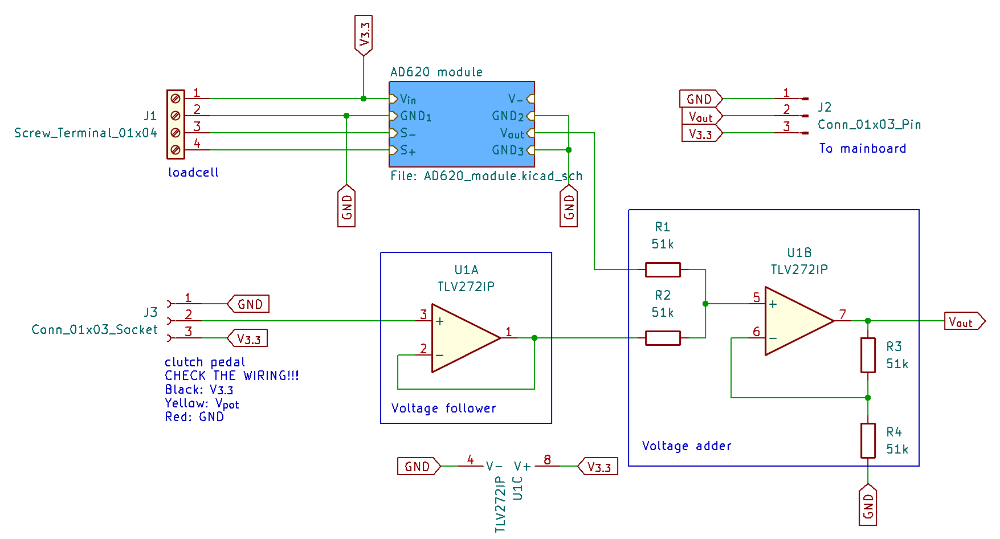
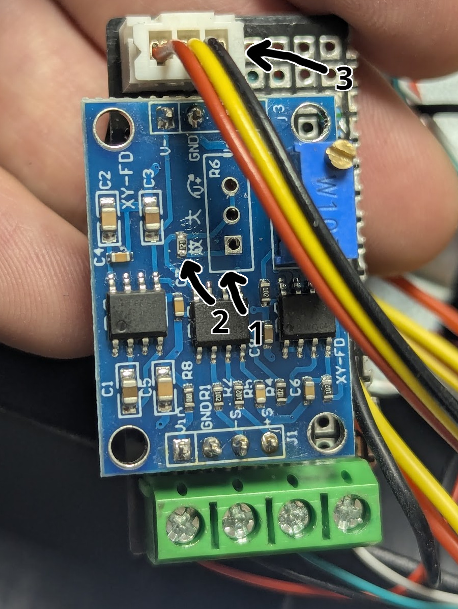
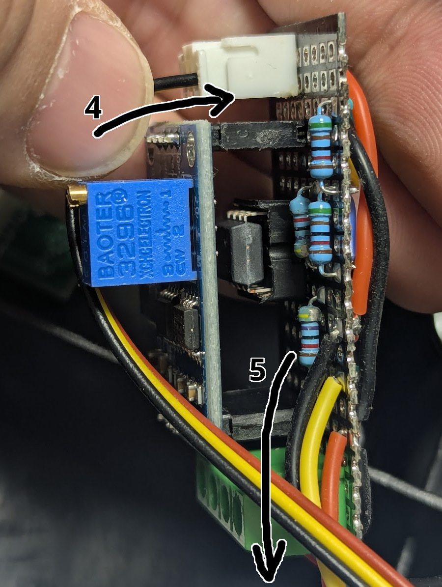
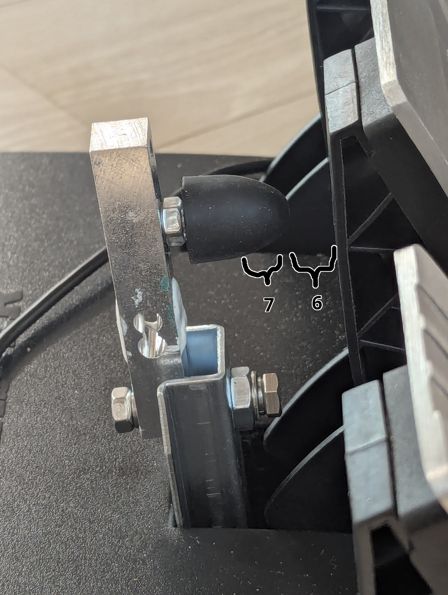

# v0: A prototype

I've built a prototype on a prototype board with a hand-soldering. I've made some mistakes, but it works fine.
PCB design included in the repo is a replica of the layout of the prototype.

## Overview

The idea is simple: Add voltages from two components with a voltage adder circuit.

## Parts

* Load cell
  * CZL-611P 40kg
  * 4-pin screw terminal block (5mm)
* Load cell amplifier
  * AD620 breakout module
  * 0603 (1608 metric) resistor (100 Ohm)
  * 1x4 female pin header (x2, 2.54mm pitch)
* Voltage adder
  * TLV272IP
  * 4 identical resistors (approx. 50k Ohm, 0.25W)
  * DIP-8 socket
* 3-pin JST-XH connectors
  * housing: XHP-3
  * header: B3B-XH-A/B3B-XH-AM
* and some mounting hardware
  * M6x18X20X25 conical rubber shock absorber
  * M6xM10 thread inserts
  * M6x35 bolts, M6 nuts

## Details

### The existing potentiometer

This is the measurement of potentiometers of mine:

|                | Gas   | Brake | Clutch |
| -------------- | ----- | ----- | ------ |
| V to GND (Ohm) | 24.8k | 21.9k |  24.0k |
| at rest (Ohm)  | 8.8k  | 12.0k |   9.7k |
| at full (Ohm)  | 24.8k | 21.9k |  24.0k |

I don't know why there are huge differences between the potentiometers, and how the wheel auto-calibrates,
but the important thing is that the voltage doesn't swing a whole range of 0V ~ 3.3V. The brake swings just from 1.8V to 3.3V.
So I have to tune the load cell amplifier to have a range of 1.5V.

Please check the wiring since it doesn't follow normal color codes. Mine was black for 3.3V, red for GND, and yellow for voltage output.

### CZL-611P 40kg

I bought it from [AliExpress](https://ko.aliexpress.com/item/1005007928954675.html). 50kg one arrived (it doesn't matter for the application).

The store page says the output sensitivity is '10 ± 0.1mVN', but I think it is a typo. Some other websites say it is '1.0 ± 0.1mV/V'.
So, the output voltage difference at full load (50kg) will be 3.3mV because the given excitation voltage is 3.3V.
To get an approx. 1.5V output range, we need a gain of approx. 450x.
If we need an output range of 1.3V, the gain will be approx. 400x.

I've cut the first screw hole part out with a hand saw to reduce interference when installing.

### AD620 breakout module

I've bought AD620 breakout modules by mistake instead of AD623. I didn't know its limited output range (V_in - 2.0V).
Luckily ~1.3V range is somewhat enough for this project (the first 0.2V range will be covered by the potentiometer)

You can buy it and get more information about it from [Proto Supplies](https://protosupplies.com/product/ad620-instrumentation-amplifier-module/).
Or you could get cheaper clones from AliExpress instead. It seems that there are several versions of it on Aliexpress. The module's dimension that I've used is 32mm * 22mm.

To get a gain of 400x, I've changed its 100K trimmer potentiometer with a fixed 120 Ohm resistor by following the Proto Supplies' guide (R_gain = 49.9K / (Gain -1).
After that, I adjusted the zero offset with the load cell connected.

You shouldn't remove 7660 since it seems necessary to our application's range.

### TLV272IP

I bought LM358 at first because AD620 module used it, and I discovered that it heavily clips the output voltage (maximum output is approx. 2.0V out of 3.3V) too late.
It might be the reason why AD620 breakout module's range is limited and it needs 7660!
Luckily, I found a StackExchange answer that suggested a rail-to-rail op-amp such as TLV27x series[^stackexchange].
It is pin-to-pin compatible with LM358, so I've bought TLV272IP.
It was a good idea to use DIP-8 socket instead of directly soldering LM358 to the board.

[^stackexchange]: https://electronics.stackexchange.com/a/357054

Exact resistor values don't matter unless they are large (10k~100k Ohm), and relatively equal to each other (R1 = R2, R3 = R4). I've actually picked R1 = R2 = 51k, R3 = R4 = 47k.

### Mounting hardware

I bought M6x18X20X25 conical rubber shock absorber because CZL-611P has M6 threaded holes.

* [M6x18X20X25 - AliExpress](https://www.aliexpress.com/item/1005005386072058.html)

I've used a M6xM10 threaded insert since T3PA's bracket has M10 threaded hole while CZL-611P has M6 threaded hole. I bought 10mm length one, but 12mm or 15mm one would've been nicer to work with.
A M10 nut that is included in T3PA's bracket mod kit is used to lock the threaded insert to the bracket.
M6x35 bolt, M6 nuts to mount CZL-611 onto the bracket.

* [M6xM10 threaded insert - AliExpress](https://www.aliexpress.com/item/1005006827476112.html)

## Photos

Here are some photos of the prototype board.

  

1. Removed gain trimmer potentiometer.
2. Installed 120 Ohm resistor (metric 1608, imperial 0603)
3. The connector from the existing potentiometer. Don't be fooled by wiring colors.
4. From the potentiometer.
5. To the mainboard of the pedal.
6. The range that is covered by the potentiometer.
7. The range that is covered by the load cell.

## Result

You can control the brakes delicately as you could before in the potentiometer range.
In the load cell range, you can feel the physical resistance when you hit the brakes hard while not losing controllability.
The transition between the potentiometer and the load cell is smooth as expected although the output is a little bit noisier than before.
