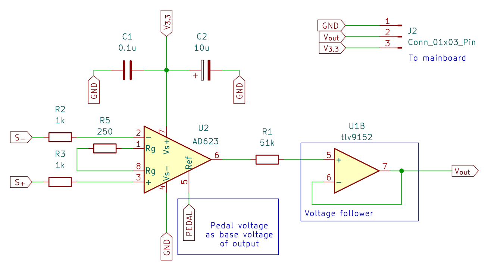
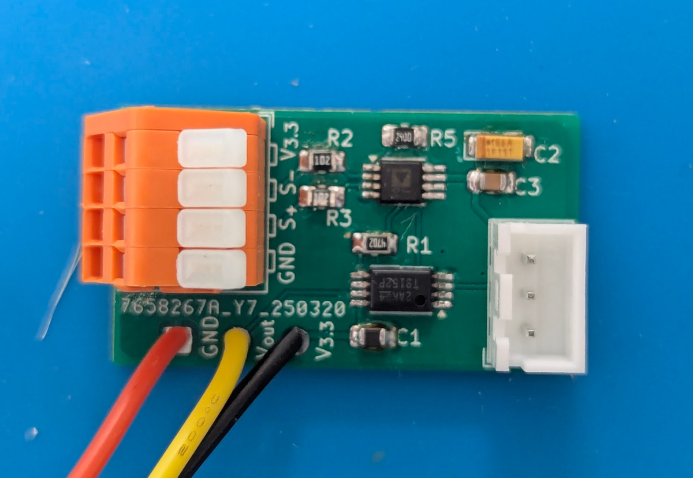
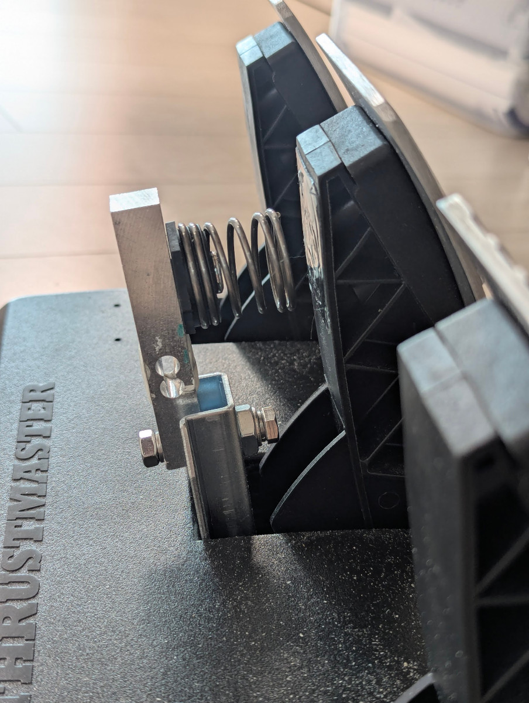

# v1

I've designed a PCB for a better design. I've fixed my mistakes.

## Overview

The idea is simple: Use amplifier's REF pin to add the pedal's voltage.

## Parts

* Load cell
  * CZL-611P 40kg
  * Wago 233-504, but KF141R would do the job.
* PCB
  * AD623ARMZ
  * TLV9152IPWR
  * 0805 SMD resistors, capacitors, optional tantalum caps.
* 3-pin JST-XH connectors
  * housing: XHP-3
  * header: B3B-XH-A/B3B-XH-AM
* and some mounting hardware
  * M6x2.1x27x35 Compression Spring Seat
  * M6xM10 thread inserts
  * M6x35 bolts, M6 nuts

## Details

Electrical details are the same with [v0](../t3pa-loadcell-mod-v0/README.md).

### PCB

I've used AD620 before, but I've changed it to AD623 which has a rail-to-rail characteristics.
I've chosen 240 Ohm resistor to have 400x gain according to the datasheet.

While skimming through the datasheet, I've noticed Ref pin is used to control the output voltage offset. So I decided to abuse it to add the potentiometer.

I've ordered the PCB from [JLCPCB](https://jlcpcb.com/). Hand-soldering was not that hard.

### Mounting hardware

I've changed conical rubber shock absorber with M6x2.1x27x35 compression spring seat because why not? It can be mounted using M6 bolt. It has the right amount of compression force than the rubber shock absorber. I've removed the cap to reduce the height.

* [M6x2.1x27x35 compression spring seat - AliExpress](https://www.aliexpress.com/item/1005006497936423.html)

The rest is the same with the v0.

## Photos

 

## Result

Much better than v0. It's smaller, simpler, and less noisy.