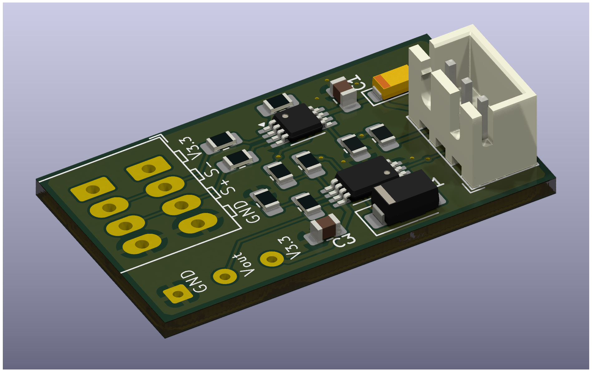

# v2

I've fixed my mistakes, again.

## v1's mistake

I abused `REF` pin as a voltage adder in v1 to simplify the circuit.
It worked fine, but it had a limited operating range.
When you apply more voltage to the `REF` pin, the output range starts to shrink,
so basically it had 1.8V ~ 2.0V range.

## Overview

```
   load cell ---> amplifier ---.
                              voltage adder ---> output
pedal ---> voltage follower ---`
```

Basically, back to the same configuration with v0, but with better components.

## Parts

* Load cell
  * CZL-611P 40kg
  * Wago 233-504, but KF141R would do the job.
* PCB
  * INA333AIDGKR
  * TLV9152IPWR
  * ES1J
  * 0805 SMD resistors, capacitors, optional tantalum caps.
* 3-pin JST-XH connectors
  * housing: XHP-3
  * header: B3B-XH-A/B3B-XH-AM
* and some mounting hardware
  * M6x2.1x27x35 Compression Spring Seat
  * M6xM10 thread inserts
  * M6x35 bolts, M6 nuts

## Details

Electrical details are the same with [v0](../t3pa-loadcell-mod-v0/README.md).
Physical details are the same with [v1](../t3pa-loadcell-mod-v1/README.md).

### Amplifier

I used INA333 because it has better parameters than AD623.
But I found later that TI says INA317 is an upgraded drop-in replacement of INA333.
Nevertheless, the circuits are designed with AD623 in mind.

They say AD623 (and INA333, INA317) has a rail-to-rail output.
But there's still very small output swing headroom (0.05V ~ 0.2V depending on the output current and the model),
and it is a quite noticeable when you're operating around the 0V.
So I applied ~0.4V voltage to `REF` pin with a simple voltage divider.
The datasheet says it should be driven by low impedance, but I didn't bother to use a voltage follower.

### Diode

Also, I used a diode to trim some voltage of the pedal.
The pedal's voltage range is already 1.8V ~ 3.3V.
With the 0.4V added to the `REF` pin, there's merely 1.1V of operating range left.
So I added ES1J diode to the pedal, which had a forward voltage of ~0.6V @ 0.01A.
It trimmed ~0.4V, which is less than I've expected, maybe because the current was too miniscule.

I also bought US1M, which has a forward voltage of ~0.8V @ 0.01A, but I didn't use it because I become lazy at this point.

## Photos



The load cell is not changed, see [v1](../t3pa-loadcell-mod-v1/README.md).

## Result

Slightly better than v1. I could say the project is finished.